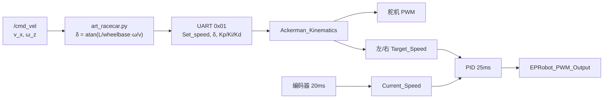

# 单片机驱动、底盘控制模型与控制算法

> **对应赛规技术报告要求（3）：** 清晰描述单片机驱动方法、底盘控制模型和控制算法等。  
> **硬件与固件来源：** EPRobot 官方底盘（`底盘原理图及程序`，原理图 `EPRobot_base_sch_V1.3.pdf`，固件基于 RT-Thread + STM32F407）。

---

## 1. 系统概述

智慧药房配送机器人采用 **阿克曼转向结构**，满足赛规对底盘形式的硬性要求。运动控制采用**分层架构**：

| 层级 | 运行平台 | 职责 |
|------|----------|------|
| 决策与导航 | 树莓派 4（Ubuntu 18.04 + ROS Melodic） | 路径规划（move_base + TEB）、定位（AMCL/EKF）、任务调度 |
| 底盘驱动 | STM32F407 单片机（RT-Thread 实时操作系统） | 电机 PWM 驱动、编码器测速、舵机转向、IMU 采集、串口通信 |
| 执行机构 | 后轮双电机 + 前轮舵机 | 线速度跟踪、阿克曼转向、电子差速 |

上位机通过 `/cmd_vel` 下发期望线速度与角速度，底盘驱动节点 `art_racecar.py` 将其转换为**期望线速度 + 前轮转向角**，经 UART4 串口协议下发至单片机；单片机内部完成**阿克曼运动学解算**与**后轮速度闭环**，最终输出 PWM 驱动电机与舵机。

```
┌─────────────────────────────────────────────────────────────┐
│  ROS 导航栈 (move_base / TEB)                                │
│       │  /cmd_vel (v_x, ω_z)                                │
│       ▼                                                      │
│  art_racecar.py  ──UART4 115200──►  STM32F407 固件           │
│       ▲                              │  Ackerman_Kinematics  │
│       │  /odom, /imu_data            │  PID 速度闭环         │
│       └──────────────────────────────┤  PWM / 编码器 / IMU  │
└──────────────────────────────────────┴──────────────────────┘
```

---

## 2. 硬件平台与原理图

### 2.1 主控芯片与操作系统

- **MCU：** STM32F407VE（Cortex-M4，168 MHz 主频，512 KB Flash，128 KB RAM）
- **RTOS：** RT-Thread（抢占式多线程，Finsh 命令行）
- **原理图版本：** EPRobot_base_sch_V1.3（2021/4/15），分模块子图：
  - `CPU.SchDoc` — 主控与外设接口
  - `POWER.SchDoc` — 电池充电、5 V / 3.3 V 电源
  - `MOTOR.SchDoc` — 左右驱动电机、编码器、舵机 PWM
  - `Laser&PI.SchDoc` — 激光雷达串口、树莓派 UART、激光 PWM
  - `SENSOR&INTERFACE.SchDoc` — MPU6050 IMU、OLED、Flash、WiFi 等

### 2.2 关键外设与引脚映射

依据原理图与 `board.h`、`bottom_pwm.c`、`bottom_encode.h` 源码，主要资源分配如下：

| 功能 | 外设 / 引脚 | 说明 |
|------|-------------|------|
| 左后轮驱动 | TIM3 CH3 / CH4（PB0 / PB1） | 双通道 H 桥 PWM，正反转 |
| 右后轮驱动 | TIM3 CH1 / CH2（PB4 / PC7） | 双通道 H 桥 PWM，正反转 |
| 前轮舵机 | TIM8 CH1（PC6） | 50 Hz 舵机 PWM，中位 1500 μs |
| 激光雷达 PWM | TIM2 CH2（PA1） | 激光功率档位控制 |
| 散热风扇 | TIM5 CH1（PA0） | 风扇 PWM |
| 左轮编码器 | PE9（A 相）、PE11（B 相） | AB 相正交编码，GPIO 中断计数 |
| 右轮编码器 | PD12（A 相）、PD13（B 相） | AB 相正交编码，GPIO 中断计数 |
| 树莓派通信 | UART4（PC10 TX / PC11 RX） | 115200 bps，自定义帧协议 |
| IMU | I2C3（PA8 SCL / PC9 SDA） | MPU6050 六轴传感器 |
| 电池电压 | ADC1 IN15（PC5） | DMA 连续采样 |
| 调试 / WiFi | UART1、UART3 | 预留 |

### 2.3 机械参数

固件中定义的阿克曼几何参数（`bottom_steering.h`）：

| 符号 | 含义 | 数值 |
|------|------|------|
| \(L\) | 轴距（前后轮中心距） | 0.145 m |
| \(B\) | 轮距（左右后轮中心距） | 0.155 m |
| 主动轮直径 | 编码器换算用 | 0.062 m（半径 0.031 m） |
| 舵机最大转角 | 左右各限 | ±24° |
| 编码器线数 | 每圈脉冲 | 1560 PPR |

---

## 3. 单片机驱动方法

### 3.1 总体软件架构

固件采用 RT-Thread **多线程 + 定时器** 结构，各模块通过 `INIT_APP_EXPORT` 在系统启动时自动初始化：

| 模块 | 源文件 | 周期 / 触发 | 功能 |
|------|--------|-------------|------|
| 串口通信 | `bottom_uart.c` | 中断接收 + 线程解析 | 解析上位机指令，回复速度/IMU/电池 |
| 速度闭环 | `bottom_pid.c` | **25 ms** 线程循环 | PID 控制 + 阿克曼解算（默认启用） |
| 编码器测速 | `bottom_time.c` | **20 ms** 硬件定时器 | AB 相计数 → RPM → 线速度 |
| IMU 采集 | `bottom_mpu6050.c` | 独立线程 | MPU6050 姿态与角速度 |
| 电池监测 | `bottom_adc.c` + `main.c` | 50 ms 主循环 | ADC DMA 采样，蜂鸣器 / LED 提示 |
| OLED 显示 | `bottom_oled.c` | 独立线程 | 状态显示 |

> **说明：** 工程内同时实现了 **MFAC（无模型自适应控制）** 算法（`bottom_mfac.c`，30 ms 周期），但 `INIT_APP_EXPORT(MFAC_thread_start)` 已被注释，**实车默认使用 PID 方案**。

### 3.2 电机 PWM 驱动

后轮驱动采用 **TIM3 四通道 PWM** 实现双 H 桥控制。函数 `EPRobot_PWM_Output()` 根据左右轮 PWM 正负号选择不同通道输出：

- **正转：** 一路通道输出占空比，互补通道置 0
- **反转：** 互补通道输出占空比，原通道置 0

TIM3 配置：预分频 83、周期 1000 → PWM 频率约 **2 kHz**，适合直流电机驱动。

```564:583:底盘原理图及程序/applications/src/bottom_pwm.c
void EPRobot_PWM_Output(signed short Moto_Left,signed short Moto_Right)
{
    if(Moto_Left >= 0){
        __HAL_TIM_SetCompare(&htim3, TIM_CHANNEL_3, 0);
        __HAL_TIM_SetCompare(&htim3, TIM_CHANNEL_4, abs(Moto_Left));
    }
    else{
        __HAL_TIM_SetCompare(&htim3, TIM_CHANNEL_3, abs(Moto_Left));
        __HAL_TIM_SetCompare(&htim3, TIM_CHANNEL_4, 0);
    }
    // ... 右轮同理 ...
}
```

**死区补偿：** PID 控制在输出侧叠加 `PWM_BASE = 230` 的基础偏置，克服驱动器与电机静摩擦死区（约 ±230 计数范围内电机不转）。

### 3.3 舵机转向驱动

前轮转向由 **TIM8 CH1** 输出标准舵机 PWM（20 ms 周期，脉宽 500–2500 μs 对应 0°–180°）。

`EPRobot_Steering_position()` 将弧度制转向角转换为 PWM：

1. 弧度 → 度，并乘以比例系数 `P_STEER_WHEEL = 1.0`
2. 限幅至 ±24°
3. 线性映射：**每 1° 对应 11 个 PWM 计数**，中位 `STEERING_MIDDLE_VALE = 1500`
4. 左转为减小 PWM，右转为增大 PWM

```23:41:底盘原理图及程序/applications/src/bottom_steering.c
void  EPRobot_Steering_position(float angle)
{
    unsigned short Pwm_Output = 0;
    angle = angle * 180.0 / PI * P_STEER_WHEEL;
    if(angle > STEERING_MAX_ANGLE) angle = STEERING_MAX_ANGLE;
    else if (angle < -STEERING_MAX_ANGLE) angle = -STEERING_MAX_ANGLE;
    Pwm_Output = fabs(angle) * 11;
    if(angle>0)
        Forward_steer.ESC_Output_PWM = STEERING_MIDDLE_VALE - Pwm_Output;
    else
        Forward_steer.ESC_Output_PWM = STEERING_MIDDLE_VALE + Pwm_Output;
    EPRobot_steering_Output(Forward_steer.ESC_Output_PWM);
}
```

### 3.4 编码器测速

采用 **软件 AB 相正交解码**（GPIO 双边沿中断 + 查表法），而非硬件定时器编码器模式：

- 左轮：PE9 / PE11；右轮：PD12 / PD13
- 每圈 1560 脉冲（`LEFT/RIGHT_PULSE_PER_REVOL`）
- 20 ms 定时器调用 `Robot_Encoder_Get_Vel()` 计算 RPM，再换算线速度：

\[
v = \frac{0.062 \times \pi \times \text{RPM}}{60} \times k_v \quad (\text{m/s})
\]

其中 \(k_v = 1.0\) 为速度标定系数（可在实车标定中调整）。

### 3.5 IMU 与辅助外设

- **MPU6050：** 经 I2C3 读取三轴加速度与陀螺仪，经 DMP 或软件融合后提供 `yaw` 角与角速度，供串口协议 0x09 / 0x13 命令回传上位机。
- **激光 PWM：** 根据通信连接状态与 `Laser_status` 字段切换 Max / Eco / Stop 三档功率。
- **安全机制：** 串口通信超时计数 `COM_MAX_CNT = 20`（约 400 ms 无有效帧），超时后自动 `Set_speed = 0`、转向角归零，实现**通信丢失停车**。

---

## 4. 底盘控制模型

### 4.1 阿克曼运动学结构

本车为**单舵机前轮转向 + 双后轮驱动**的经典阿克曼布局。上位机 ROS 节点订阅 `/cmd_vel`，将线速度 \(v_x\) 与角速度 \(\omega_z\) 转换为**等价前轮转向角** \(\delta\)（`art_racecar.py`）：

\[
R = \frac{v_x}{\omega_z}, \quad \delta = \arctan\left(\frac{L_{\text{base}}}{R}\right)
\]

其中 `wheelbase = 0.335 m` 为 ROS 侧轴距参数（与固件 \(L = 0.145\) m 为不同参考系下的标定值，分别用于上位机换算与下位机差速）。

单片机收到期望线速度 \(v\) 与转向角 \(\delta\) 后，调用 `Ackerman_Kinematics()` 完成两件事：

1. **舵机转向：** 调用 `EPRobot_Steering_position(δ)`
2. **后轮电子差速：** 按转弯半径分配左右轮目标线速度

### 4.2 电子差速模型

转弯时，内外侧后轮路径半径不同，需分配不同线速度以避免侧滑。固件实现如下（`bottom_steering.c`）：

\[
R_{\text{turn}} = \frac{L}{\tan|\delta|}, \quad \Delta v = v \cdot \frac{B/2}{R_{\text{turn}}}
\]

- 当 \(\delta = 0\) 时，左右轮目标速度均为 \(v\)
- 当 \(\delta \neq 0\) 时，内侧轮 \(v_{\text{in}} = v \mp 0.2 \Delta v\)，外侧轮 \(v_{\text{out}} = v \pm 0.2 \Delta v\)（系数 0.2 为工程折减，抑制急转时内侧轮过慢）

```58:88:底盘原理图及程序/applications/src/bottom_steering.c
void Ackerman_Kinematics(float DiversionAngle, float LinearX)
{
    float Vin, Vout;
    float rotateRadius,dif;
    EPRobot_Steering_position(DiversionAngle);
    if(DiversionAngle == 0) {
        Back_Leftmoto.Target_Speed = Back_Rightmoto.Target_Speed = LinearX;
        return;
    }
    rotateRadius = L / tan(fabs(DiversionAngleVal));
    dif = LinearX * HALF_B / rotateRadius;
    // ... 限幅与左右轮分配 ...
}
```

### 4.3 控制信号流



---

## 5. 控制算法

### 5.1 增量式 PID 速度闭环（默认方案）

每个控制周期（25 ms），PID 线程依次执行：

1. 检查通信连接，断开则清零速度指令
2. `Ackerman_Kinematics()` — 运动学解算
3. 对左、右轮分别调用 `EPRobot_moto_Control_speed()`

**算法形式：** 增量式（位置式 PID 的差分变体），利用当前误差 \(e(k)\)、一阶差分 \(e(k)-e(k-1)\) 与二阶差分 \(e(k)-2e(k-1)+e(k-2)\)：

\[
\Delta u = K_p \cdot \Delta e + K_i \cdot e + K_d \cdot \Delta^2 e
\]

**默认参数：**

| 参数 | 默认值 | 说明 |
|------|--------|------|
| \(K_p\) | 22.6 | 比例增益 |
| \(K_i\) | 16.5 | 积分（直接乘当前误差） |
| \(K_d\) | 11.0 | 微分（二阶差分） |
| 单次增量限幅 | ±20 | `PWM_once_LIMT` |
| 输出限幅 | ±980 | `ESC_output_PWM_LIMT` |

参数可通过串口 0x01 命令由上位机**在线调整**（`art_racecar.py` 中 `base_kp/ki/kd` 参数，默认 1000/100/0，经协议缩放后写入 MCU）。

**停车逻辑：** 当 `target_speed == 0` 且误差为 0 时，清零积分状态与 PWM 输出，避免零速抖动。

```146:161:底盘原理图及程序/applications/src/bottom_pid.c
static void PID_thread1_entry(void *parameter)
{
    pwm_init();
    while (1)
    {
        if(IfConnect()==0) {
            Set_speed = 0;
            Forward_steer.Receive_Angle = 0;
        }
        Ackerman_Kinematics(Forward_steer.Receive_Angle, Set_speed);
        EPRobot_moto_Control_speed(Back_Leftmoto.Current_Speed, Back_Leftmoto.Target_Speed, MOTO_LEFT);
        EPRobot_moto_Control_speed(Back_Rightmoto.Current_Speed, Back_Rightmoto.Target_Speed, MOTO_RIGHT);
        rt_thread_mdelay(25);
    }
}
```

### 5.2 MFAC 无模型自适应控制（备选方案）

`bottom_mfac.c` 实现了 **MFAC（Model-Free Adaptive Control）** 作为 PID 的替代方案，适用于电机参数漂移或负载变化较大的场景。核心步骤：

1. **伪偏导数在线估计** \(\hat{\phi}(k)\)（PFDL-MFAC 标准公式）
2. **控制律：** \(u(k) = u(k-1) + \rho \cdot \hat{\phi}(k) \cdot \frac{y_d - y(k)}{\lambda + \hat{\phi}^2(k)}\)
3. **死区补偿：** PWM 输出落在 ±50 死区内时强制跳至 ±`PWM_BASE`
4. **非线性预测：** \(y(k+1) = y(k) + \hat{\phi}(k) \cdot \Delta u(k)\)

关键超参数：`rou=0.5`（步长，越大响应越快）、`lamda=3×10⁻⁶`（正则化，越小跟踪越紧）、`eita=1`、`miu=1`。

该线程当前 **未通过 INIT_APP_EXPORT 启用**；如需切换，注释 PID 的 `INIT_APP_EXPORT` 并启用 MFAC 即可。两套算法共用同一套阿克曼解算与 PWM 输出接口。

### 5.3 算法对比

| 特性 | 增量式 PID | MFAC |
|------|-----------|------|
| 控制周期 | 25 ms | 30 ms |
| 模型依赖 | 需整定 Kp/Ki/Kd | 无需精确电机模型，在线估计 |
| 调参难度 | 中等，参数有明确物理意义 | 需调节 rou、lamda，对 lamda 敏感 |
| 实车默认 | **是** | 否（代码保留，未导出启动） |
| 死区处理 | PWM_BASE 偏置 | 显式死区跳变 |

---

## 6. 上下位机通信协议

树莓派与 STM32 通过 **UART4，115200 bps，8N1** 通信。帧格式：

```
[0x5A] [LEN] [0x01] [CMD] [DATA...] [CRC8]
```

CRC-8 算法与 `bottom_uart.c`、`art_racecar.py` 中 `CRC8Calculate()` / `crc_byte()` 一致。

### 6.1 主要命令字

| CMD | 方向 | 功能 | 关键数据 |
|-----|------|------|----------|
| 0x01 | Pi → MCU | 速度 / 转向 / PID 参数 | `Set_speed`(mm/s)、`δ`(mrad)、Kp/Ki/Kd |
| 0x03 | Pi → MCU | 查询速度 | 回复 0x04：合速度、左轮 PWM、舵机 PWM |
| 0x07 | Pi → MCU | 查询电池 | 回复 0x08：电压 |
| 0x09 | Pi → MCU | 查询里程 / IMU 摘要 | 回复 0x0A：速度、yaw、角速度；可附带激光模式 |
| 0x13 | Pi → MCU | 查询完整 IMU | 回复 0x14：陀螺仪、加速度、四元数等 |
| 0x21 | Pi → MCU | 树莓派状态上报 | CPU 温度、内存、IP 等 |

**连接保活：** 每次收到合法帧，`connect_cnt` 重置为 20；定时器每 20 ms 递减。计数归零则判定失联并停车。

### 6.2 ROS 侧封装

官方包 `eprobot_start/art_racecar.py` 完成以下映射：

- 订阅 `/cmd_vel` → 发送 0x01
- 50 Hz 定时发送 0x09 → 发布 `/odom`、`/imu_data`
- 1 Hz 发送 0x07 → 发布 `/battery`
- 可选发布 `odom → base_footprint` TF（与 EKF 联用时通常关闭，由 `robot_localization` 融合）

---

## 7. 与 ROS 导航栈的衔接

在智慧药房系统中，底盘控制位于导航栈最底层：

1. **move_base + TEB** 局部规划器输出 `/cmd_vel`（满足阿克曼最小转弯半径约束）
2. **art_racecar.py** 将 Twist 转为串口帧，并积分编码器 + IMU _yaw 发布 `/odom`
3. **robot_localization (EKF)** 融合 `/odom` 与 IMU，输出 `/odometry/filtered`
4. **AMCL** 在静态地图上修正全局位姿

TEB 中配置的关键阿克曼参数（实车 `nav_real_ws`）与底盘能力对应：

- `min_turning_radius ≈ 0.52 m`
- `wheelbase ≈ 0.335 m`（ROS 模型）
- `max_vel_x ≈ 1.2 m/s`（与官方 `official_max_vel` 预设一致）

单片机层负责**毫秒级实时跟踪**，ROS 层负责**路径级约束**；二者通过 `/cmd_vel` 与串口协议解耦，便于分别调参与维护。

---

## 8. 小结

| 赛规要求 | 本队实现要点 |
|----------|--------------|
| 单片机驱动方法 | STM32F407 + RT-Thread；TIM3 双 H 桥电机 PWM、TIM8 舵机 PWM、GPIO AB 相编码器、I2C IMU、UART4 通信；20 ms 测速 + 25 ms PID 闭环 |
| 底盘控制模型 | 阿克曼单舵机 + 双后轮驱动；`Ackerman_Kinematics()` 实现转向与电子差速；ROS 侧 `cmd_vel → δ` 换算 |
| 控制算法 | 默认**增量式 PID**（Kp=22.6, Ki=16.5, Kd=11.0，可在线调参）；备选 **MFAC** 无模型自适应控制；通信丢失自动停车 |

本章节内容已并入 `TECH_REPORT.md` **第四章**，并与第三章「自主导航与运动控制」形成上下位机完整闭环说明。

---

*文档版本：v1.0 · 依据 `底盘原理图及程序` 源码与 `EPRobot_base_sch_V1.3.pdf` 整理*
