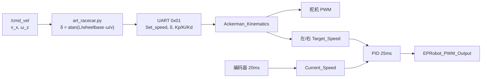

# 智慧药房配送机器人技术报告

> **第二十八届中国机器人及人工智能大赛 · 机器人任务挑战赛 · 智慧药房赛项**
>
> 队伍名称：____________　　学校：____________　　队伍编号：____________

---

## 摘要

本作品面向智慧药房赛项，设计并实现了一套可在体检区与化验区之间自主完成样本配送的机器人系统。机器人须在不依赖人工遥控的前提下，依次完成识别板读码、体检区取样、识别板二状态判断、化验区送样及裁判数据上报等五项任务；本队围绕赛规要求构建了完整的任务闭环，并在流程设计、播报格式与配送策略上对齐评分细则，兼顾完成率与加分项。

系统基于 EPRobot 阿克曼底盘与 ROS Melodic 开发，采用分层架构：导航层负责精准到达各任务航点，视觉层解析两块识别板信息，任务主控层编排单轮配送逻辑，通信层向裁判软件持续上报状态并支持双车协同。备赛过程中，本队自主搭建了与实车高度对齐的 Gazebo 仿真环境，承担导航调参、航点标定与全流程联调，实车阶段聚焦验证与微调，形成「仿真迭代、实车确认」的闭环。工程上另实现了双车 home/standby 轮流接力、开赛 5 秒倒计时、识别板一鲁棒读码，以及识别板二 Tesseract / PaddleOCR 双后端可选，是本队除任务实现外的另一项重要工程工作。

---

## 一、赛项任务理解与总体方案

### 1.1 比赛场景

场地模拟医院智慧送检区域，面积约 4.9 m × 3.8 m。体检区设 A、B、C 三个窗口，可产生静脉血、唾液、组织、血浆四类样本；化验区设 1、2、3、4 四个窗口，分别对应血常规、体液、免疫检测、激素检验。两块识别板承担「任务下发」与「通行决策」职能：识别板一以二维码告知本轮取样窗口与目标化验窗口；识别板二以屏幕文字提示化验区空闲或需等待的时间。

比赛要求机器人完全自主运行，4 分钟内取最高分轮次计场地成绩，并与技术报告按 7:3 综合评定。本队以**场上稳定完赛、减少扣分、争取规则内加分**为首要目标进行方案设计。

### 1.2 样本与窗口对应关系

理解样本—窗口映射是正确完成任务的前提，本队在主控与视觉模块中均按赛规固化如下逻辑：

| 化验窗口 | 样本类型 | 识别板一方框编号 |
|----------|----------|------------------|
| 1 血常规 | 静脉血 | 方框 1 |
| 2 体液 | 唾液 | 方框 2 |
| 3 免疫检测 | 组织 | 方框 3 |
| 4 激素检验 | 血浆 | 方框 4 |

识别板一上的二维码内容表示体检区哪些窗口有样本（如 A、AB、ABC），机器人须据此前往对应窗口取样，并配送到上表对应的化验窗口。

### 1.3 系统总体架构

本队将软件划分为四层，自上而下支撑比赛任务：

**任务决策层**——药房赛项核心，解析识别板信息，编排取样路线与送样目标，触发语音播报，驱动单轮任务循环。

**导航层**——在已知地图下定位与路径规划，将机器人送达识别板前、各体检窗口、各化验窗口等语义航点。

**感知层**——相机采集识别板图像，激光雷达与 IMU 支撑定位；视觉算法输出结构化任务指令。

**通信层**——独立裁判 TCP 节点按协议上报速度、位置、任务阶段与视觉结果；双车模式下经 CarLink 协议交换站位与轮次信号，实现 home/standby 轮流接力。

实车采用 EPRobot 官方底盘；日常开发中借助仿真环境对上述四层进行联调，但**场上行为与得分逻辑始终以任务层设计为中心**。

---

## 二、五项比赛任务的实现（核心章节）

本章按赛规任务 1–5 顺序，说明本队如何实现各项要求及与评分的对应关系。

### 2.1 任务一：识别板一读码与任务获取

**赛规要求**：从起点出发至识别板一，获取体检区样本窗口、样本类别及目标化验窗口信息。

**本队实现**：机器人导航至识别板前固定航点（`board1_scan`），停车抓图，由二维码识别模块对整幅快照执行全图 pyzbar 解码。模块通过亮区质心划分四象限，将每个有效二维码映射至 slot 1–4（左上/右上/左下/右下），输出本轮是否存在 A/B/C 窗口样本、目标化验窗口编号（1–4）及样本数量。主控据此生成本轮配送计划，并同步更新裁判上报字段中的视觉结果（CV2）。

**设计要点**：识别板一信息决定整轮任务走向。板上可能同时存在多个有效二维码（赛规约每分钟更新 2 个），视觉模块在有效候选中优先选取 **A/B/C 样本数最多** 的一格（如 `ABC` 优于 `AB`），以配合一次性配送加分策略；样本数相同时取 slot 编号更小者。识别失败时，主控立即返回 `home` 后重新前往识别板一，循环重试直至成功，避免在错误读码基础上继续执行整轮任务。主控按「完成一轮再读下一轮」的方式循环，与场上节奏相匹配。

### 2.2 任务二：体检区取样与播报

**赛规要求**：根据识别结果前往 A、B、C 窗口取样本，并进行语音播报，格式如「取到 A、B 窗口中的血浆样本」。

**本队实现**：主控按识别板一结果动态生成取样路线，仅访问有样本的窗口。到达各窗口后车身整体停入方框并停留约 1.5 秒，满足规则对「明显停留」的要求，同时降低因停车不到位导致的扣分风险。全部取样完成后，播放与窗口组合、样本类型对应的预录语音，语句格式对齐赛规示例。双车模式下，本车到达 A/B/C 任一取样点后发送 `REACHED_ABC` 信号，通知 standby 侧对端可前往 home 候工。

**得分策略**：规则对一次性取完同一二维码中的全部样本设有加分（三个窗口 +25 分，两个 +15 分，一个 +5 分）。本队默认采用**一次读码、依次取完、一次送样**的策略，在确保送达窗口正确的前提下争取加分。

### 2.3 任务三：识别板二识别与通行决策

**赛规要求**：到达识别板二区域，识别化验区状态；若空闲则 3 秒内尽快通过并播报，若忙碌则播报识别内容并等待相应秒数后再通过。

**本队实现**：机器人导航至识别板二前抓图，OCR 模块识别屏幕中文内容，并提取等待秒数。本队准备了两套 OCR 方案，可按场上情况切换（`use_paddle_ocr:=true/false`），对外统一暴露 `Board2Decode` 服务接口：**方案 A Tesseract（默认）** 单次识别约 **1 秒**，延迟低、满足任务三「空闲 3 秒内通过」的时效要求，但在屏幕反光或阴影下准确率不足；**方案 B PaddleOCR（可选）** 单次识别约 **3 秒**，速度较慢但中文屏显识别非常准确，适合对读字可靠性要求更高的场次。主控根据结果分支执行：空闲时立即播报「化验区空闲中，请快速通过」并尽快继续行驶；忙碌时播报完整识别文字（如「化验区忙碌中，需等待 8 秒」），等待对应秒数后再通过。播报内容与识别文字一致，满足赛规对人机交互的要求，并可获得识别板二相关的行为加分。

### 2.4 任务四：化验区送样与播报

**赛规要求**：将样本配送至对应 1、2、3、4 号化验窗口，并播报如「到达血常规窗口，样本数为 3」。

**本队实现**：主控根据识别板一给出的目标窗口编号，导航至对应化验区航点，停入方框并短暂停留后，播放与窗口名称、样本数量匹配的送样语音。窗口选择与识别板一解析结果严格绑定，避免送错窗口导致本轮失败或加分无效。

### 2.5 任务五：裁判系统数据上报

**赛规要求**：通过局域网以 1–2 Hz 向裁判软件发送 JSON，包含速度、里程计坐标、视觉识别结果、所在位置及当前任务等信息。

**本队实现**：主控节点持续汇总本车编号、实时速度、地图坐标（支持 TF `map→base_link` 或里程计话题）、当前所处阶段（体检区 A/B/C、化验区 1/2/3/4 或途中 R）、识别板二结果（CV1）与二维码结果（CV2），发布至 ROS 话题 `/judgement/report`；独立节点 `judgement_tcp_sender` 以 **1.5 Hz** 经 TCP 推送 JSON 至裁判端。业务逻辑与通信解耦，各车参数集中在 `real_car1.yaml` / `real_car2.yaml` 中，赛前可根据现场公布的 IP 与端口快速配置。

**预备态不上报**：机器人在 **home / standby** 起点预备阶段不发布裁判上报，TCP 发送端在超时无新消息后亦不再刷旧 JSON，避免待命位误报。任务进行中才持续上报，字段与赛规及裁判细则对齐，以争取速度、里程计、任务、视觉等分项加分。

### 2.6 单轮任务流程概览

综合上述五项任务，本队**单车**单轮配送流程为：

**home → 识别板一读码 → 体检区取样（含播报）→ 识别板二决策（含播报与等待）→ 化验区送样（含播报）→ 回 home → 下一轮**

**双车**模式下，1 号车初始在 home、2 号车在 standby；送样完成后本车回 **standby** 并发送 `ROUND_DONE`，home 侧对端收到信号后再出发开始下一轮。该流程与赛规任务 1–4 顺序一致，任务五贯穿全程（预备态除外）。四项关键节点均设有语音播报，对应规则中的播报加分项。

### 2.7 开赛同步（5 秒倒计时）

实车双车模式下，本队启用 **5 秒开赛倒计时**（`enable_prestart_countdown`）：两车到达 home/standby 后车际与裁判 TCP 就绪，1 号车倒计时结束广播 `MATCH_START`，2 号车收到后同步开工；不设软件侧 4 分钟自动停赛。

---

## 三、自主导航与运动控制

导航能力是所有比赛任务的空间基础。智慧药房赛道属于典型室内结构化环境：通道宽度有限，体检区与化验区各窗口要求**车身整体停入方框**并短暂停留，对定位精度、路径平滑度与终点朝向均有较高要求。本队底盘为阿克曼结构，具有明显的前轮转向与非完整运动学约束，不宜简单套用差速小车的导航参数。本章从底盘特性、定位融合、路径规划、代价地图与任务衔接五个方面，说明本队的导航技术方案。

### 3.1 阿克曼底盘与分层控制

本队实车采用 EPRobot 官方阿克曼底盘，满足赛规对 CPU 算力、内存、Ubuntu 18.04、ROS 及阿克曼结构的要求。阿克曼小车通过前轮转向改变行驶方向，后轮驱动，运动学上存在「不能横移、转弯半径受限」等约束，速度指令表现为线速度与角速度的组合，由底层驱动节点跟踪执行。

软件上采用分层控制结构：**底层**为 STM32F407 单片机固件（RT-Thread），负责电机 PWM 驱动、编码器测速、舵机转向与 IMU 采集；**中层**为 ROS 导航栈（move_base），负责在地图坐标系下生成满足运动学约束的速度指令；**上层**为药房任务主控，通过 move_base 的 Action 接口依次下发语义航点，不直接参与路径计算。仿真中使用比例一致的简化 URDF 模型，同样配置阿克曼运动插件，车身尺寸约 0.35 m × 0.20 m，满足赛规投影尺寸下限，传感器布局（激光雷达、RGB 相机、IMU）与实车对应，使仿真中的运动与感知特性对实车具有参考价值。

### 3.2 定位：EKF 融合与 AMCL 粒子滤波

本队定位方案为「**IMU + 里程计融合 → AMCL 激光匹配**」的两级结构。

第一级，采用扩展卡尔曼滤波（EKF）融合底盘发布的轮式里程计与 IMU 角速度/加速度信息，输出平滑后的 `/odometry/filtered`。阿克曼小车在加减速、急转弯时，单纯依赖轮式里程计易产生滑移与累积误差；引入 IMU 后，短时内的姿态变化估计更可靠，为后续定位与局部规划提供更稳定的里程输入。

第二级，采用 AMCL（自适应蒙特卡洛定位）在已知静态栅格地图上进行粒子滤波定位。激光雷达扫描数据（实车与仿真均为 `/scan_filtered`）与地图匹配，估计机器人在 `map` 坐标系下的位姿。AMCL 适合赛场布局固定、可提前建图的场景，与赛规「赛前统一标准地图、各队自主运行」的设定一致。定位结果以 TF 变换 `map → odom → base_footprint` 发布，任务主控与裁判上报均基于 `map` 坐标系下的位置。

实车默认采用 EKF 融合后的 `/odometry/filtered` 作为里程输入；若 EKF 未启用，则提供 `nav_real_amcl_no_ekf*.launch` 变体，由底盘直接发布 odom TF。双车分别使用 `nav_real_amcl_car1.launch` / `nav_real_amcl_car2.launch`，AMCL 初值与各自初始站位（home / standby）对齐。

备选方案方面，本队亦验证了 Hector SLAM 在线建图能力，用于仿真阶段生成地图或实车无先验地图时的探索，但正式比赛流程以 **AMCL + 静态地图** 为主，以保证定位稳定性与坐标一致性。

### 3.3 路径规划：全局规划与 TEB 局部规划

本队采用 ROS move_base 框架，全局与局部规划分工明确：

**全局规划**在静态代价地图上搜索从当前位置到目标点的可行路径，本队使用基于 Dijkstra/A* 的全局规划器，适合结构化室内环境中的通道级路径生成。

**局部规划**选用 TEB（Timed Elastic Band）时间弹性带算法。与 DWA 等速度采样方法相比，TEB 在轨迹优化中显式考虑阿克曼运动学约束，通过最小转弯半径、轴距等参数限制可行轨迹，生成的路径更平滑，有利于窄道通行与精确停车。本队在 TEB 中配置了多边形 footprint（约 0.29 m × 0.21 m，与车身投影一致）、最小转弯半径约 0.52 m、目标位置容差约 0.12 m、航向容差约 0.1 rad，并关闭同伦类多路径规划（homotopy class planning），避免局部规划在复杂障碍附近产生多条候选轨迹切换、导致 `/cmd_vel` 输出频率抖动的问题——实车验收中，`/cmd_vel` 应稳定在约 7.5–8 Hz，这是导航可靠性的重要指标。

**方案对比**：本队曾在仿真中对比 DWA 与 TEB，DWA 实现简单但在阿克曼约束下易出现轨迹折返或停车姿态不佳；EBand 等算法拓扑清晰但调参成本较高。综合窄道、精确停点与实车表现，最终选定 TEB 作为局部规划器。

**多套参数预设**：本队在 `nav_*_ws/src/car_sim/param/` 中维护多套 TEB 配置文件，通过 launch 参数 `teb_config` 切换，便于在不同场景快速试验：

| 预设文件 | 用途 |
|----------|------|
| `base_local_planner_params_TEB.yaml` | 默认保守 |
| `base_local_planner_params_TEB_smooth.yaml` | 顺滑路径，减轻弯口反复修角 |
| `base_local_planner_params_TEB_conservative_half.yaml` | 一半速度，窄道或联调 |
| `base_local_planner_params_TEB_official_max_vel.yaml` | 对齐官方最大速度 1.2 m/s |

### 3.4 代价地图与避障

move_base 使用分层代价地图（costmap）：**全局代价地图**以静态地图为基础，叠加障碍物膨胀层；**局部代价地图**以机器人为中心滚动更新，融合实时激光扫描，用于局部避障。

本队对代价地图的关键调参包括：障碍物膨胀半径、机器人 footprint 多边形、激光障碍物有效范围等。智慧药房赛道挡板较多、通道较窄，膨胀过大易导致规划失败，过小则增加刮蹭风险。参数在仿真中结合 RViz 可视化反复调整——观察代价地图着色、规划轨迹与车身 footprint 的关系——确认无误后再用于实车，以减少碰障扣分（规则规定每次碰撞扣 2 分）。

激光数据经滤波后以 `/scan_filtered` 供导航使用，与实车官方驱动保持一致；仿真中通过话题桥接将 Gazebo 的 `/scan` 转发为 `/scan_filtered`，保证仿真与实车共用同一套 costmap 配置。

### 3.5 任务航点与 move_base 衔接

任务主控不直接发布速度，而是将比赛语义地点抽象为**航点序列**，每个航点包含地图坐标 `(x, y)` 与期望航向角 `yaw`，通过 move_base Action 客户端依次下发。本队在 `GOAL_LIST` 中定义 **10 个固定语义航点**：`home`、识别板一（`board1_scan`）、体检区 A/B/C（`pickup_A/B/C`）、识别板二（`board2_scan`）、化验区 1–4（`deliver_1`–`deliver_4`）；双车模式下运行时注入 **standby** 预备点（坐标由 `real_car*.yaml` 配置）。坐标在 Gazebo 仿真中结合识别板与窗口位置标定，经地图原点对齐后用于实车。

导航到达判定后，主控更新裁判上报中的 `task` 字段（A/B/C/1/2/3/4 或途中 R），并在识别板、取样、送样等节点触发抓图或语音播报。终点航向角的设计尤其重要：化验区与体检区窗口要求车身正向停入方框，TEB 的 `yaw_goal_tolerance` 与航点 `yaw` 需联合调优，避免「位置到了但车身斜停」导致停车不到位扣分。

主控对单次导航设有启动超时与失败终态检测：若 move_base 返回 ABORTED、REJECTED 等失败状态，则中止当前轮次而非盲目重试，防止机器人在异常状态下持续碰撞。双车 TCP 未连接前主控不会开始导航；home 侧需等对端 `ROUND_DONE`（对端已到 standby）后再出工（1 号车首轮除外）。

### 3.6 仿真对导航调参的支撑

导航参数敏感、耦合度高，本队绝大部分 TEB 与 costmap 调参在 Gazebo 仿真中完成：利用 RViz 的 2D Nav Goal 逐点测试各航点可达性与停车姿态，利用 `/cmd_vel` 频率与轨迹平滑度评估局部规划质量，在不同 TEB 预设（默认 / smooth / conservative_half / official_max_vel）间对比选型，确认后再迁移至实车做最终微调。这一流程显著减少了实车试跑次数，也降低了挡板损坏与传感器震动的风险。

---

## 四、单片机驱动、底盘控制模型与控制算法

> **对应赛规技术报告要求（3）：** 清晰描述单片机驱动方法、底盘控制模型和控制算法等。  
> **硬件与固件来源：** EPRobot 官方底盘（`底盘原理图及程序`，原理图 `EPRobot_base_sch_V1.3.pdf`，固件基于 RT-Thread + STM32F407）。

本章从单片机固件层面说明底盘的驱动实现、阿克曼运动学模型与速度闭环算法，与第三章 ROS 导航栈形成上下位机完整闭环。

### 4.1 系统概述

智慧药房配送机器人采用 **阿克曼转向结构**，满足赛规对底盘形式的硬性要求。运动控制采用**分层架构**：

| 层级 | 运行平台 | 职责 |
|------|----------|------|
| 决策与导航 | 树莓派 4（Ubuntu 18.04 + ROS Melodic） | 路径规划（move_base + TEB）、定位（AMCL/EKF）、任务调度 |
| 底盘驱动 | STM32F407 单片机（RT-Thread 实时操作系统） | 电机 PWM 驱动、编码器测速、舵机转向、IMU 采集、串口通信 |
| 执行机构 | 后轮双电机 + 前轮舵机 | 线速度跟踪、阿克曼转向、电子差速 |

上位机通过 `/cmd_vel` 下发期望线速度与角速度，底盘驱动节点 `art_racecar.py` 将其转换为**期望线速度 + 前轮转向角**，经 UART4 串口协议下发至单片机；单片机内部完成**阿克曼运动学解算**与**后轮速度闭环**，最终输出 PWM 驱动电机与舵机。

```
┌─────────────────────────────────────────────────────────────┐
│  ROS 导航栈 (move_base / TEB)                                │
│       │  /cmd_vel (v_x, ω_z)                                │
│       ▼                                                      │
│  art_racecar.py  ──UART4 115200──►  STM32F407 固件           │
│       ▲                              │  Ackerman_Kinematics  │
│       │  /odom, /imu_data            │  PID 速度闭环         │
│       └──────────────────────────────┤  PWM / 编码器 / IMU  │
└──────────────────────────────────────┴──────────────────────┘
```

### 4.2 硬件平台与原理图

#### 4.2.1 主控芯片与操作系统

- **MCU：** STM32F407VE（Cortex-M4，168 MHz 主频，512 KB Flash，128 KB RAM）
- **RTOS：** RT-Thread（抢占式多线程，Finsh 命令行）
- **原理图版本：** EPRobot_base_sch_V1.3（2021/4/15），分模块子图：
  - `CPU.SchDoc` — 主控与外设接口
  - `POWER.SchDoc` — 电池充电、5 V / 3.3 V 电源
  - `MOTOR.SchDoc` — 左右驱动电机、编码器、舵机 PWM
  - `Laser&PI.SchDoc` — 激光雷达串口、树莓派 UART、激光 PWM
  - `SENSOR&INTERFACE.SchDoc` — MPU6050 IMU、OLED、Flash、WiFi 等

#### 4.2.2 关键外设与引脚映射

依据原理图与 `board.h`、`bottom_pwm.c`、`bottom_encode.h` 源码，主要资源分配如下：

| 功能 | 外设 / 引脚 | 说明 |
|------|-------------|------|
| 左后轮驱动 | TIM3 CH3 / CH4（PB0 / PB1） | 双通道 H 桥 PWM，正反转 |
| 右后轮驱动 | TIM3 CH1 / CH2（PB4 / PC7） | 双通道 H 桥 PWM，正反转 |
| 前轮舵机 | TIM8 CH1（PC6） | 50 Hz 舵机 PWM，中位 1500 μs |
| 激光雷达 PWM | TIM2 CH2（PA1） | 激光功率档位控制 |
| 散热风扇 | TIM5 CH1（PA0） | 风扇 PWM |
| 左轮编码器 | PE9（A 相）、PE11（B 相） | AB 相正交编码，GPIO 中断计数 |
| 右轮编码器 | PD12（A 相）、PD13（B 相） | AB 相正交编码，GPIO 中断计数 |
| 树莓派通信 | UART4（PC10 TX / PC11 RX） | 115200 bps，自定义帧协议 |
| IMU | I2C3（PA8 SCL / PC9 SDA） | MPU6050 六轴传感器 |
| 电池电压 | ADC1 IN15（PC5） | DMA 连续采样 |
| 调试 / WiFi | UART1、UART3 | 预留 |

#### 4.2.3 机械参数

固件中定义的阿克曼几何参数（`bottom_steering.h`）：

| 符号 | 含义 | 数值 |
|------|------|------|
| \(L\) | 轴距（前后轮中心距） | 0.145 m |
| \(B\) | 轮距（左右后轮中心距） | 0.155 m |
| 主动轮直径 | 编码器换算用 | 0.062 m（半径 0.031 m） |
| 舵机最大转角 | 左右各限 | ±24° |
| 编码器线数 | 每圈脉冲 | 1560 PPR |

### 4.3 单片机驱动方法

#### 4.3.1 总体软件架构

固件采用 RT-Thread **多线程 + 定时器** 结构，各模块通过 `INIT_APP_EXPORT` 在系统启动时自动初始化：

| 模块 | 源文件 | 周期 / 触发 | 功能 |
|------|--------|-------------|------|
| 串口通信 | `bottom_uart.c` | 中断接收 + 线程解析 | 解析上位机指令，回复速度/IMU/电池 |
| 速度闭环 | `bottom_pid.c` | **25 ms** 线程循环 | PID 控制 + 阿克曼解算（默认启用） |
| 编码器测速 | `bottom_time.c` | **20 ms** 硬件定时器 | AB 相计数 → RPM → 线速度 |
| IMU 采集 | `bottom_mpu6050.c` | 独立线程 | MPU6050 姿态与角速度 |
| 电池监测 | `bottom_adc.c` + `main.c` | 50 ms 主循环 | ADC DMA 采样，蜂鸣器 / LED 提示 |
| OLED 显示 | `bottom_oled.c` | 独立线程 | 状态显示 |

> **说明：** 工程内同时实现了 **MFAC（无模型自适应控制）** 算法（`bottom_mfac.c`，30 ms 周期），但 `INIT_APP_EXPORT(MFAC_thread_start)` 已被注释，**实车默认使用 PID 方案**。

#### 4.3.2 电机 PWM 驱动

后轮驱动采用 **TIM3 四通道 PWM** 实现双 H 桥控制。函数 `EPRobot_PWM_Output()` 根据左右轮 PWM 正负号选择不同通道输出：正转时一路通道输出占空比、互补通道置 0，反转则相反。TIM3 配置预分频 83、周期 1000，PWM 频率约 **2 kHz**，适合直流电机驱动。

**死区补偿：** PID 控制在输出侧叠加 `PWM_BASE = 230` 的基础偏置，克服驱动器与电机静摩擦死区（约 ±230 计数范围内电机不转）。

#### 4.3.3 舵机转向驱动

前轮转向由 **TIM8 CH1** 输出标准舵机 PWM（20 ms 周期，脉宽 500–2500 μs 对应 0°–180°）。`EPRobot_Steering_position()` 将弧度制转向角转换为 PWM：弧度 → 度并限幅至 ±24°，再按**每 1° 对应 11 个 PWM 计数**线性映射，中位 `STEERING_MIDDLE_VALE = 1500`；左转为减小 PWM，右转为增大 PWM。

#### 4.3.4 编码器测速

采用 **软件 AB 相正交解码**（GPIO 双边沿中断 + 查表法）：左轮 PE9 / PE11，右轮 PD12 / PD13，每圈 1560 脉冲。20 ms 定时器调用 `Robot_Encoder_Get_Vel()` 计算 RPM，再换算线速度：

\[
v = \frac{0.062 \times \pi \times \text{RPM}}{60} \times k_v \quad (\text{m/s})
\]

其中 \(k_v = 1.0\) 为速度标定系数（可在实车标定中调整）。

#### 4.3.5 IMU 与辅助外设

- **MPU6050：** 经 I2C3 读取三轴加速度与陀螺仪，融合后提供 `yaw` 角与角速度，供串口协议 0x09 / 0x13 命令回传上位机。
- **激光 PWM：** 根据通信连接状态与 `Laser_status` 字段切换 Max / Eco / Stop 三档功率。
- **安全机制：** 串口通信超时计数 `COM_MAX_CNT = 20`（约 400 ms 无有效帧），超时后自动 `Set_speed = 0`、转向角归零，实现**通信丢失停车**。

### 4.4 底盘控制模型

#### 4.4.1 阿克曼运动学结构

本车为**单舵机前轮转向 + 双后轮驱动**的经典阿克曼布局。上位机 ROS 节点订阅 `/cmd_vel`，将线速度 \(v_x\) 与角速度 \(\omega_z\) 转换为**等价前轮转向角** \(\delta\)（`art_racecar.py`）：

\[
R = \frac{v_x}{\omega_z}, \quad \delta = \arctan\left(\frac{L_{\text{base}}}{R}\right)
\]

其中 `wheelbase = 0.335 m` 为 ROS 侧轴距参数（与固件 \(L = 0.145\) m 为不同参考系下的标定值，分别用于上位机换算与下位机差速）。

单片机收到期望线速度 \(v\) 与转向角 \(\delta\) 后，调用 `Ackerman_Kinematics()` 完成舵机转向与后轮电子差速分配。

#### 4.4.2 电子差速模型

转弯时内外侧后轮路径半径不同，需分配不同线速度以避免侧滑。固件实现（`bottom_steering.c`）：

\[
R_{\text{turn}} = \frac{L}{\tan|\delta|}, \quad \Delta v = v \cdot \frac{B/2}{R_{\text{turn}}}
\]

- 当 \(\delta = 0\) 时，左右轮目标速度均为 \(v\)
- 当 \(\delta \neq 0\) 时，内侧轮 \(v_{\text{in}} = v \mp 0.2 \Delta v\)，外侧轮 \(v_{\text{out}} = v \pm 0.2 \Delta v\)（系数 0.2 为工程折减，抑制急转时内侧轮过慢）

#### 4.4.3 控制信号流



### 4.5 控制算法

#### 4.5.1 增量式 PID 速度闭环（默认方案）

每个控制周期（25 ms），PID 线程依次执行：检查通信连接 → `Ackerman_Kinematics()` 运动学解算 → 对左、右轮分别调用 `EPRobot_moto_Control_speed()`。

**算法形式：** 增量式 PID，利用当前误差 \(e(k)\)、一阶差分与二阶差分：

\[
\Delta u = K_p \cdot \Delta e + K_i \cdot e + K_d \cdot \Delta^2 e
\]

**默认参数：**

| 参数 | 默认值 | 说明 |
|------|--------|------|
| \(K_p\) | 22.6 | 比例增益 |
| \(K_i\) | 16.5 | 积分 |
| \(K_d\) | 11.0 | 微分 |
| 单次增量限幅 | ±20 | `PWM_once_LIMT` |
| 输出限幅 | ±980 | `ESC_output_PWM_LIMT` |

参数可通过串口 0x01 命令由上位机**在线调整**（`art_racecar.py` 中 `base_kp/ki/kd` 参数）。当 `target_speed == 0` 且误差为 0 时，清零积分状态与 PWM 输出，避免零速抖动。

#### 4.5.2 MFAC 无模型自适应控制（备选方案）

`bottom_mfac.c` 实现了 **MFAC（Model-Free Adaptive Control）** 作为 PID 的替代方案，核心步骤为：伪偏导数在线估计 \(\hat{\phi}(k)\)；控制律 \(u(k) = u(k-1) + \rho \cdot \hat{\phi}(k) \cdot \frac{y_d - y(k)}{\lambda + \hat{\phi}^2(k)}\)；死区跳变补偿与非线性速度预测。关键超参数：`rou=0.5`、`lamda=3×10⁻⁶`。该线程当前**未启用**；两套算法共用同一套阿克曼解算与 PWM 输出接口。

#### 4.5.3 算法对比

| 特性 | 增量式 PID | MFAC |
|------|-----------|------|
| 控制周期 | 25 ms | 30 ms |
| 模型依赖 | 需整定 Kp/Ki/Kd | 无需精确电机模型，在线估计 |
| 调参难度 | 中等，参数有明确物理意义 | 需调节 rou、lamda，对 lamda 敏感 |
| 实车默认 | **是** | 否（代码保留，未导出启动） |
| 死区处理 | PWM_BASE 偏置 | 显式死区跳变 |

### 4.6 上下位机通信协议

树莓派与 STM32 通过 **UART4，115200 bps，8N1** 通信，帧格式：`[0x5A] [LEN] [0x01] [CMD] [DATA...] [CRC8]`，CRC-8 算法与固件、ROS 驱动一致。

| CMD | 方向 | 功能 | 关键数据 |
|-----|------|------|----------|
| 0x01 | Pi → MCU | 速度 / 转向 / PID 参数 | `Set_speed`(mm/s)、`δ`(mrad)、Kp/Ki/Kd |
| 0x03 | Pi → MCU | 查询速度 | 回复 0x04：合速度、左轮 PWM、舵机 PWM |
| 0x07 | Pi → MCU | 查询电池 | 回复 0x08：电压 |
| 0x09 | Pi → MCU | 查询里程 / IMU 摘要 | 回复 0x0A：速度、yaw、角速度 |
| 0x13 | Pi → MCU | 查询完整 IMU | 回复 0x14：陀螺仪、加速度、四元数等 |
| 0x21 | Pi → MCU | 树莓派状态上报 | CPU 温度、内存、IP 等 |

**连接保活：** 每次收到合法帧 `connect_cnt` 重置为 20；定时器每 20 ms 递减，计数归零则判定失联并停车。

官方包 `eprobot_start/art_racecar.py` 完成 ROS 侧封装：订阅 `/cmd_vel` → 发送 0x01；50 Hz 发送 0x09 → 发布 `/odom`、`/imu_data`；1 Hz 发送 0x07 → 发布 `/battery`。

### 4.7 与 ROS 导航栈的衔接

底盘控制在系统中的位置如下：

1. **move_base + TEB** 局部规划器输出 `/cmd_vel`（满足阿克曼最小转弯半径约束）
2. **art_racecar.py** 将 Twist 转为串口帧，并积分编码器 + IMU yaw 发布 `/odom`
3. **robot_localization (EKF)** 融合 `/odom` 与 IMU，输出 `/odometry/filtered`
4. **AMCL** 在静态地图上修正全局位姿

单片机层负责**毫秒级实时跟踪**，ROS 层负责**路径级约束**；二者通过 `/cmd_vel` 与串口协议解耦，便于分别调参与维护。

### 4.8 本章小结

| 赛规要求 | 本队实现要点 |
|----------|--------------|
| 单片机驱动方法 | STM32F407 + RT-Thread；TIM3 双 H 桥电机 PWM、TIM8 舵机 PWM、GPIO AB 相编码器、I2C IMU、UART4 通信；20 ms 测速 + 25 ms PID 闭环 |
| 底盘控制模型 | 阿克曼单舵机 + 双后轮驱动；`Ackerman_Kinematics()` 实现转向与电子差速；ROS 侧 `cmd_vel → δ` 换算 |
| 控制算法 | 默认**增量式 PID**（Kp=22.6, Ki=16.5, Kd=11.0，可在线调参）；备选 **MFAC**；通信丢失自动停车 |

---

## 五、计算机视觉与人机交互

智慧药房赛项的两块识别板承载「任务下发」与「通行决策」职能，是连接感知与任务逻辑的枢纽。本队视觉系统采用**主控抓图 + 独立视觉节点 + ROS 服务接口**的架构：主控负责在正确航点触发拍照并保存图像，视觉节点负责解码/OCR 并返回结构化结果，二者通过服务调用解耦，便于分模块开发、离线测试与仿真联调。本章分别阐述识别板一、识别板二的技术方案，以及语音播报与主控协同机制。

### 5.1 视觉系统总体架构

整体数据流为：机器人到达识别板前航点 → 主控订阅相机话题（实车 `/camera/rgb/image_raw`）保存一帧快照 → 主控调用视觉服务并传入图片路径 → 视觉节点读取图片、执行算法、返回结构化字段 → 主控据此更新任务计划、裁判上报字段（CV1/CV2）及语音播报。

该架构的设计考量有三：其一，**抓图与识别分离**，相机回调中不做耗时识别，避免阻塞 ROS 回调队列；其二，**服务接口标准化**，识别板一返回 `has_a/b/c`、`delivery_slot`、`sample_count`，识别板二返回 `wait_seconds`、`speech_text`，主控无需了解图像算法细节；其三，**支持离线测试**，可用静态测试图注入相机话题，在不启动 Gazebo、不依赖实车的情况下验证 QR/OCR 模块。

### 5.2 识别板一：亮区质心 + 全图二维码解码

识别板一是一块包含四个方格的看板，左上、右上、左下、右下分别对应化验窗口 1–4。每个方格内可能出现二维码，二维码文本仅含体检窗口字母（如 `A`、`AB`、`ABC`），表示哪些窗口有样本；方格位置则隐含目标化验窗口与样本类型（方框 1→血常规/静脉血，方框 2→体液/唾液，方框 3→免疫检测/组织，方框 4→激素检验/血浆）。

扫码本身采用全图 **pyzbar** 多尺度解码（1.0× / 1.5× / 2.0×，失败则试反色图），**扫到 ≥1 个有效码即判定成功**，不要求四格齐全。关键难点在于：多个二维码同时出现时，须将每个码映射到 slot 1–4 以确定 `delivery_slot`。为此需要先确定一块「参考中心」，再按四象限划分位置。本队先后尝试三种思路：

| 方案 | 思路 | 主要问题 |
|------|------|----------|
| 方框检测 | 检测四个黑框轮廓，分格裁剪后逐格 pyzbar | 对光照、透视敏感，黑框边缘易干扰，**稳定性不足** |
| 图像中心四分 | 以整幅照片的几何中心为原点划分四象限 | 停车姿态或视角变化时，识别板在画面中会偏移，**屏幕中心 ≠ 图像中心**，slot 易判错 |
| **亮区质心（现用）** | 对灰度图取白色区域像素求几何中心，以此为参考点四分 | 参考点随识别板在画面中的位置自适应，**鲁棒性最好** |

本队最终选用**亮区质心**方案：识别板主体为白色底板，对灰度图取亮白像素（阈值 `bright_thresh`，默认 165）求坐标均值，得到屏幕参考中心；亮像素过少时退回图像几何中心作为兜底。每个 QR 码的中心相对该参考点落入左上/右上/左下/右下，即映射为 slot 1–4。

完整流程如下：

**第一步，亮区质心估计。** 计算识别板白色区域的几何中心，作为后续 slot 分配的参考原点。

**第二步，全图 pyzbar 扫码。** 对整幅快照多尺度解码，过滤面积低于 `min_qr_area` 的噪声框。

**第三步，象限分配 slot。** 按每个 QR 中心相对亮区质心的象限，映射为 slot 1–4。

**第四步，多码决策。** 识别板可能同时存在多个有效二维码（赛规约每分钟更新 2 个）。本队在有效候选中优先选择 **A/B/C 样本数最多** 的一格（如 `ABC` 优于 `AB`），以争取一次性配送 +25 分；样本数相同时取 slot 编号更小者。

解码后将字母映射为布尔标志 `has_a`、`has_b`、`has_c`，并统计 `sample_count`；结合 slot 编号得到 `delivery_slot`（1–4）。识别失败时，主控返回 `home` 后重新前往识别板一，循环重试直至成功。各 slot 裁剪图（按 QR 外接框保存）写入 `snapshots/` 目录，便于赛后分析与参数调优。

### 5.3 识别板二：OCR 预处理与等待时间提取

识别板二是一块显示中文状态信息的屏幕，典型内容为「化验区空闲中，请快速通过」或「化验区忙碌中，需等待 n 秒」。本队提供 **双 OCR 后端**，对外统一暴露 `Board2Decode` 服务（默认 `/yaofang_vision/board2_decode`），主控无需感知底层引擎差异。两套方案在速度与准确率上形成互补：

| 方案 | 引擎 | 单次耗时 | 准确率 | 适用场景 |
|------|------|----------|--------|----------|
| A（默认） | Tesseract | 约 1 s | 中等 | 时效优先、光照较均匀 |
| B（可选） | PaddleOCR | 约 3 s | 高 | 反光/阴影下仍须可靠读字 |

**方案 A：Tesseract（默认）**——加载 `chi_sim` 中文语言包，配合 ROI 裁剪、高斯滤波与二值化（Otsu 或自适应阈值）。识别板二文案高度固定，本队启用 **关键词推断**（`use_keyword_inference`）：当整句 OCR 出现乱码时，依据 ROI 内「化/空/忙/秒」等关键字拼出符合赛规格式的标准句。OCR 引擎在节点启动时预热一次，进一步压低首次请求延迟。

**方案 B：PaddleOCR（可选）**——在 EPRobot 树莓派 4 上直接运行，不依赖 Docker。实车平台为 **aarch64 + ROS Melodic（Python 2.7）**，PaddleOCR 无法在 ROS 进程内直接使用，本队采用 **Py2 ROS 服务 + Py3 HTTP 推理** 的分层架构：Melodic 侧 `ocr_paddle_service.py` 注册 `Board2Decode` 并转发请求，Python 3 侧 Flask 服务（`paddle_ocr_server.py`）在本机端口 8765 执行 PaddleOCR 推理；主控设 `use_paddle_ocr:=true` 即可切换，接口与 Tesseract 完全一致。

为在树莓派 4 上稳定部署 PaddleOCR，本队针对 ARM 环境与网络条件做了专门适配：

- **Miniforge 替代官方 Miniconda**：默认采用 **Miniforge**（`conda-forge` 发行版），选用树莓派 4 / aarch64 专用安装包；相比官方 Miniconda，可规避 ARM 平台上常见的 `Illegal instruction` 崩溃问题。
- **一键安装脚本**：编写 `setup_paddle_conda.sh`，自动下载 Miniforge、创建独立 `paddleocr` 虚拟环境（Python 3.9）并安装依赖；安装至用户目录 `~/miniconda3`，**不执行 `conda init`**，避免影响小车原有 shell 与其他队员环境。
- **国内网络与离线安装**：支持 `CONDA_MIRROR=tsinghua` 使用清华镜像加速下载；亦支持 `CONDA_INSTALLER_LOCAL` 指定本地已下载的 `Miniforge3-Linux-aarch64.sh`，应对赛场或实验室网络不稳定的情况。
- **服务化启动**：`run_paddle_ocr_server.sh` 封装 conda 激活与服务拉起，配合健康检查脚本，便于赛前一键验证 OCR 就绪。

**等待时间提取**是识别板二的关键逻辑。OCR 输出的全文存入 `speech_text`，供语音播报原样使用；等待秒数则通过正则表达式从文本中提取，**仅匹配带时间单位的数字**（如「8 秒」「8s」），避免将窗口编号、日期等无关数字误判为等待时间。若文本中无等待时间，则 `wait_seconds=0`，主控按「空闲」分支执行快速通过。

主控收到结果后的行为分支为：`wait_seconds=0` 时，播报识别文字并尽快继续行驶；`wait_seconds>0` 时，播报完整文字并 `sleep` 对应秒数后再通过，严格对齐赛规任务三与识别板二加分项。

### 5.4 主控与视觉的协同机制

主控采用「**异步抓图 → 同步调用服务**」模式：设置视觉任务标志后等待相机回调保存图片，保存成功后再调用 Board1Decode 或 Board2Decode 服务。服务名默认为 `/yaofang_vision/board1_decode` 与 `/yaofang_vision/board2_decode`。Board1Decode 请求/响应字段为图片路径 → `has_a/b/c` + `delivery_slot` + `sample_count`；Board2Decode 为图片路径 → `wait_seconds` + `speech_text`。

识别结果除驱动任务逻辑外，还同步写入裁判上报：识别板一结果格式化为 `CV2`（如 `AB-1` 表示 A/B 有样本、目标窗口 1），识别板二结果格式化为 `CV1`（如 `WAIT-8` 表示需等待 8 秒，`WAIT-0` 表示空闲）。裁判软件可在相应位置自动核对视觉字段，对应通信加分细则。

视觉模块与主控的解耦还带来开发便利：视觉队员可在独立终端启动 QR/OCR 节点，用 `test_image_publisher.launch` 向 `/yaofang_test/image_raw` 注入测试图；主控队员可开启 `mock_navigation:=true` 先验证任务状态机，再接入真实视觉服务，实现并行开发。截图与调试裁剪默认保存在 `control_ws/src/snapshots/`。

### 5.5 语音播报与人机交互

赛规对取样、识别板二、送样三个环节均有播报内容与格式要求，且每次合规播报可获 +1 分。本队采用**预录制 WAV 音频**方案，按「场景类别 + 语义 key」组织文件，例如取样场景 `AB_venous_blood.wav`、送样场景 `blood_3.wav`、识别板二 `free.wav` 或 `wait_8.wav` 等，主控根据识别结果拼接 key 后调用 `aplay` 播放。

预录方案相比在线 TTS（文本转语音）的优势在于：发音稳定、延迟低、格式可控，不受嵌入式平台算力波动影响；语句内容在录制阶段即对照赛规示例审核，避免场上出现「播报了但格式不符」的失分情况。识别板二场景优先使用 OCR 返回的 `speech_text` 选择或验证播报内容，保证「播报内容为识别内容」。

---

## 六、得分策略与扩展能力

### 6.1 加分项对齐

本队在方案设计阶段即将赛规评分表纳入考量：

- **一次性配送**：同一二维码内多样本一次取完、一次送完，按样本数争取 +5 / +15 / +25 加分。板一多格有码时，视觉模块优先选取 **样本数最多** 的 slot（如 `ABC`），以最大化该轮加分潜力。
- **识别板二行为**：空闲快速通过或忙碌等待后通过，配合正确播报，争取行为加分。
- **语音播报**：关键节点均按示例格式播报，争取每次 +1 分。
- **裁判上报**：任务进行中持续发送规范 JSON，争取速度、里程计、任务、视觉等通信分项加分。
- **双车协同**（可选）：home/standby 轮流接力，争取 1.5 倍总分加成。

### 6.2 扣分项规避

- 停车时尽量四轮停入方框，停留 1–2 秒，减少停车不到位扣分。
- 导航与局部规划参数经仿真与实车反复打磨，降低碰障扣分概率。
- 读码失败回 home 重试、送样窗口与读码结果绑定，减少因逻辑错误导致的无效轮次。

### 6.3 双车协同

规则允许两台小车轮流配送。本队实现了完整的 **home / standby 双站位协调** 体系，而非简单的 TCP 信号交换。

**站位与网络**：1 号车（`192.168.124.3`）初始在 **home**，作 TCP **server**（端口 9000）；2 号车（`192.168.124.9`）初始在 **standby**，作 TCP **client** 连接 1 号车。识别过的二维码会从屏幕消失，**无需**双车同步占用表。

**协调逻辑**：

- **2 号车首次出工**：在 standby 等待，直到收到对端 `REACHED_ABC` 后前往 home。
- **`ROUND_DONE` 时机**：本车 **到达 standby** 后发送（携带本轮 `delivery_slot`）；送样段仍可边播报边回 standby。
- **home 侧出工**：收到对端 `ROUND_DONE`（对端已到 standby）后再从 home 出发开始下一轮（1 号车首轮除外）。
- **standby 侧回 home**：收到对端 `REACHED_ABC` 或 `ROUND_DONE` 时，从 standby 前往 home。

**CarLink 协议**（ROS 话题 `/car_link/send`、`/car_link/recv`，TCP 一行一条 JSON）：

| type | 含义 |
|------|------|
| 0 `HEARTBEAT` | 周期站位心跳 |
| 5 `REACHED_ABC` | 前车到达 A/B/C 任一取样点，对端 standby→home |
| 2 `ROUND_DONE` | 本车到达 standby；对端 home 可开始下一轮 |
| 6 `MATCH_START` | 1 号车开赛倒计时结束，对端同步开始任务 |

**一键启动**：仿真用 `sim_car1.launch` / `sim_car2.launch`，实车用 `real_car1.launch` / `real_car2.launch`；业务参数集中在 `config/sim_car*.yaml` 与 `config/real_car*.yaml`，导航另开终端使用 `nav_real_amcl_car1` / `car2`。双车 TCP 未连接前主控不会导航。若场上以单车参赛，关闭 `dual_car_mode` 即可，送样后回 home 而非 standby。

---

## 七、仿真环境与 Sim-to-Real 开发体系

五项比赛任务链条长、模块多、停点精度要求高，若全部在实车上试错，每一轮完整试跑都需架设场地、搬运设备、人工跟跑，改一次导航参数或任务逻辑往往以十分钟计，备赛效率难以保证。本队因此将**仿真环境建设**作为与任务实现并行的工程主线：在 Gazebo 中还原智慧送检赛场，使导航、主控、视觉在虚拟环境中先行跑通，再迁移至 EPRobot 实车。本章说明仿真体系的构建思路及其对比赛任务的支撑作用。

### 7.1 虚拟赛场：按赛规还原的智慧药房场景

本队根据赛规提供的场地布局，在 Gazebo 中自行建模搭建了智慧送检区域，而非使用通用空地图凑合。虚拟场地包含体检区 A/B/C 窗口、化验区 1/2/3/4 窗口、两块识别板所在区域以及挡板围墙等关键结构，尺寸与区域划分遵循比赛说明，使机器人在仿真中的通道宽度、转弯空间与停点位置与真实赛场具有可比性。

这块「虚拟赛道」对备赛的价值在于：**随时可用、随时重置、不怕撞坏**。队员可以在 RViz 中观察代价地图与规划轨迹，在 Gazebo 中检验机器人能否顺利穿过窄道、准确停靠各窗口；识别板前的抓图点位、各取样与送样航点，也均在仿真中完成标定与反复验证。对于无法随时使用实车的学生团队而言，仿真把试错成本从「实车 + 人力 + 场地」降到了「保存代码、重启仿真」，使任务流程的迭代频率显著提高。

### 7.2 仿真与实车的同构设计

许多队伍做过仿真，却常遇到「仿真里能跑、上车就不行」的困境，根因往往是仿真与实车在话题命名、坐标系、导航软件结构上的不一致，迁移时必须大量改配置。本队从设计之初即追求**仿真—实车同构**：

- 仿真中的激光雷达、IMU 等数据，经轻量桥接后以与实车相同的话题名发布，上层导航与主控程序无需区分运行环境；
- 仿真导航与实车导航采用相同的 launch 组织方式与参数文件，区别仅在于传感器数据来自 Gazebo 还是真实硬件；
- 虚拟机器人模型在车身尺寸、传感器安装位置与坐标系定义上与 EPRobot 实车保持一致，机器人在仿真中的 spawn 位置与地图坐标原点对齐，任务航点坐标在仿真中标定后可直接用于实车。

同构带来的直接收益是：**仿真里调通的 TEB 参数、代价地图配置与任务航点，可以原样迁移至实车**；主控程序在仿真中跑通的全流程，上车后只需做必要的微调，而非重写。这符合赛规「赛前统一标准地图、各队自主运行」的设定，也增强了团队对 Sim-to-Real 迁移的信心。

**分场景 Profile 启动**：本队将仿真/实车、单车/双车、1 号/2 号车的业务参数收敛至 yaml 配置文件，通过 `sim_car1.launch`、`sim_car2.launch`、`real_car1.launch`、`real_car2.launch` 一键拉起主控、视觉、裁判 TCP 与车际 TCP，避免临场手工改参。导航层对应提供 `nav_sim_amcl.launch`、`nav_real_amcl_car1.launch`、`nav_real_amcl_car2.launch` 等入口，与主控 profile 配套使用。

### 7.3 从仿真建图到实车部署的完整链路

除导航参数外，地图本身同样可以在仿真流程中生成与验证。本队支持在 Gazebo 环境中驾驶机器人走遍场地、使用 SLAM 建图并保存栅格地图，再将地图用于实车 AMCL 定位。这意味着即使队员尚未接触真实赛道，也可在虚拟赛场中完成「建图—定位—导航—五项任务」的全链路演练。

代码部署方面，本队编写了自动化同步脚本，将开发机上的工程一键推送至实车，排除编译产物与版本控制冗余，保证小车运行版本与团队主分支一致。配合上述同构设计，形成清晰的备赛闭环：

**仿真中调参标定 → 同步代码至实车 → 实车分模块确认 → 实车全流程与裁判联调**

比赛日启动顺序与仿真阶段一致（底盘 → 导航 → 主控），队员分工明确，减少临场混乱。

### 7.4 Docker 容器化：仿真专用开发环境

EPRobot 实车与赛场运行均在树莓派 4 上**原生安装** Ubuntu 18.04 + ROS Melodic，不使用 Docker。Docker 的定位是：当队员开发机已升级至 Ubuntu 22.04/24.04、无法本机安装 Melodic 时，在容器内跑 **Gazebo 仿真**（`nav_sim.launch`），替代实车进行导航调参与流程联调——**不用于实机导航或比赛日部署**。

本队构建了统一的 Docker 镜像（`craic/Dockerfile`），预装 ROS Melodic、Gazebo、导航栈及仿真所需依赖，并在镜像构建阶段完成各工作空间的编译。队员只需安装 Docker 并挂载工程目录，即可获得与队友一致的**仿真环境**，新成员可在较短时间内启动 Gazebo、看到机器人在虚拟赛场中运动，而无需在本机重装 Melodic。容器化使 Gazebo 仿真从「某位队员机器上的特例」变为团队共享的基础设施；实车联调、视觉 OCR（含 PaddleOCR + Miniforge）均在树莓派上原生运行。

### 7.5 仿真对五项任务的具体支撑

仿真环境并非孤立存在，而是直接服务于第二章所述的各项比赛任务：

| 任务 | 仿真中的验证内容 |
|------|------------------|
| 任务一 读码 | 识别板前航点标定、抓图时机、读码失败回 home 重试流程 |
| 任务二 取样 | 各体检窗口停点精度、停留时间、取样路线顺序 |
| 任务三 识别板二 | 识别板前航点、OCR 离线测试图注入、Tesseract/Paddle 双后端、空闲/忙碌分支逻辑 |
| 任务四 送样 | 各化验窗口停点、送样窗口与读码结果绑定 |
| 任务五 上报 | 坐标与 task 字段在仿真中与停点位置的一致性校验；预备态不上报 |
| 双车协同 | `sim_car1/2.launch` 联调 home/standby、CarLink 信号与轮次交替 |

本队估计，导航与流程类问题的大部分发现与修复均前移到了仿真阶段，实车联调次数因此显著减少，宝贵备赛时间得以集中在得分策略优化与场上稳定性提升上。仿真体系本身也体现了一种适合高校机器人团队的、可复制的备赛工程方法。

---

## 八、测试验证与总结

### 8.1 验证路径

本队按「视觉离线 → 仿真全流程（含双车 profile）→ 实车分模块 → 实车全流程含裁判联调」逐步验证，确保五项任务在上线前均经过独立检验与整体跑通。尤其重视单轮完整配送在仿真中的重复演练，以及实车上播报、停点、上报三项与裁判感知一致；实车阶段另验证开赛倒计时与 home/standby 协调。

### 8.2 工作总结

本作品以智慧药房赛项五项任务为主线，完成了从读码、取样、决策、送样到裁判上报的自主配送闭环，并在配送策略、播报格式与通信协议上对齐评分规则。视觉方面，识别板一采用亮区质心 + 全图 pyzbar 的鲁棒读码方案，识别板二提供 Tesseract（快）与 PaddleOCR（准）双后端并在树莓派 4 上完成 Miniforge 部署适配；底盘方面，第四章详述了 STM32F407 单片机驱动、阿克曼运动学模型与增量式 PID 速度闭环；工程方面，实现了双车 home/standby 协调、开赛计时与分车 profile 一键启动。自主导航、底盘控制、视觉识别与语音交互共同支撑任务落地；**Gazebo 仿真环境（含 Docker 仿真专用方案）** 则为导航调参、航点标定与全流程联调提供了可复现的工程平台，使仿真成果可预期地迁移至实车，显著提升了备赛效率。

### 8.3 展望

后续将继续优化识别板在动态刷新、屏幕反光等边缘场景下的识别鲁棒性，并在实车长时运行中验证 PaddleOCR 与 Tesseract 的切换策略。双车调度已具备完整协议与场上流程，后续可针对特定对手节奏做微调。现有仿真体系可继续作为低成本的试验平台，但改进方向始终围绕**场上多轮稳定完赛、提高单轮得分**展开。

---

## 附录：硬件与软件环境（简要）

| 项目 | 说明 |
|------|------|
| 机器人平台 | EPRobot 阿克曼底盘，满足赛规尺寸与算力要求；1 号车 192.168.124.3，2 号车 192.168.124.9 |
| 操作系统 | Ubuntu 18.04 |
| 软件框架 | ROS Melodic |
| 主要能力 | 五项比赛任务闭环、STM32 底盘驱动 + PID 闭环、AMCL+TEB 导航、亮区质心 QR + Tesseract/Paddle OCR、裁判 JSON 上报、双车 CarLink 协同 |
| 开发支撑 | Gazebo 仿真场地、Docker 仿真专用环境（非实车）、分车 profile launch（sim/real_car1/2） |

---

*报告版本：v2.6 · 新增第四章单片机驱动与底盘控制算法（赛规要求 3）*
